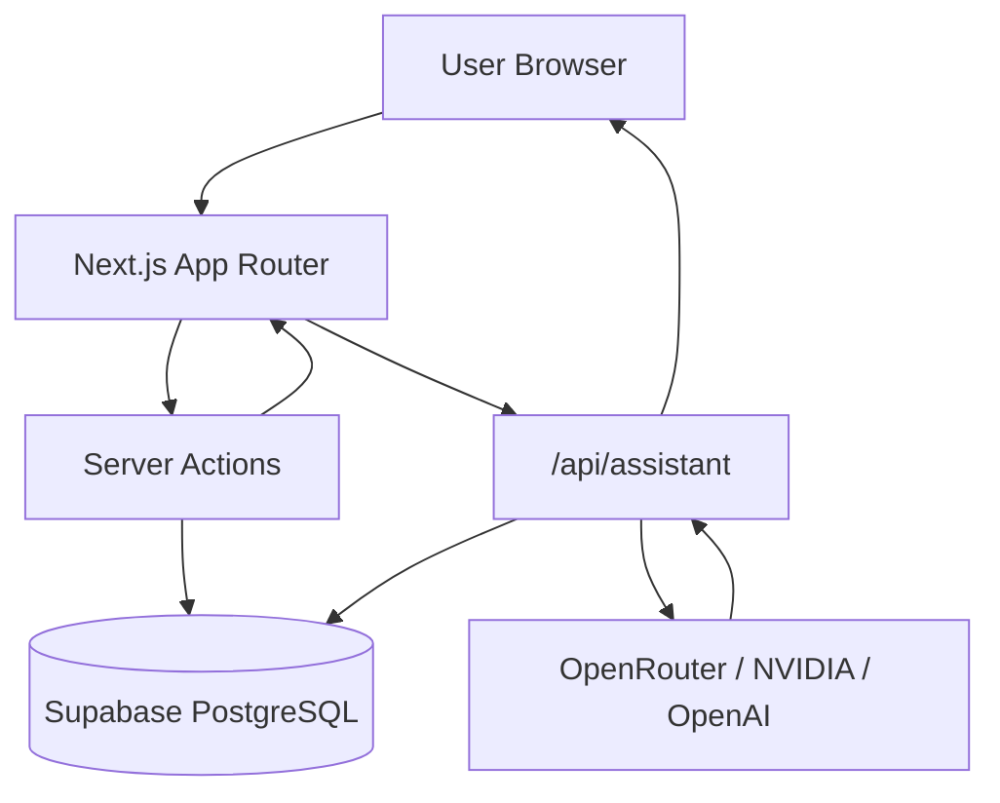
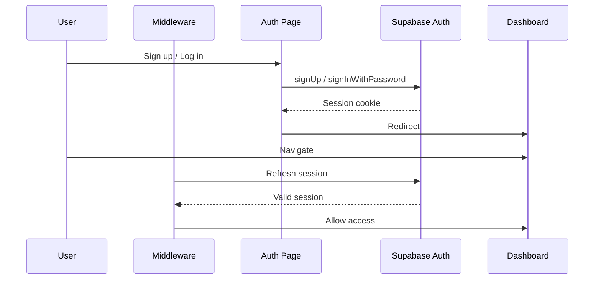
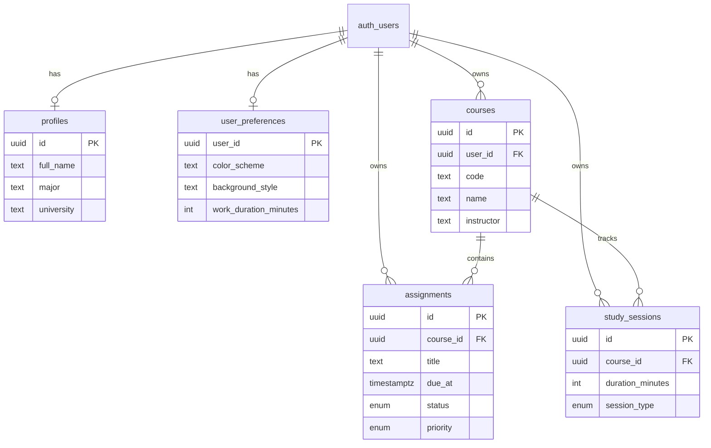
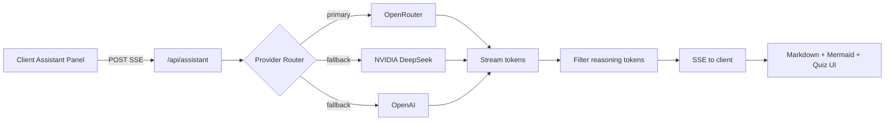
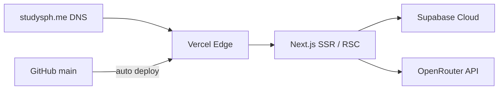
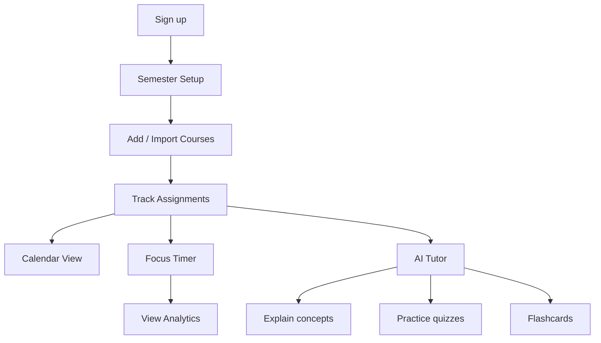
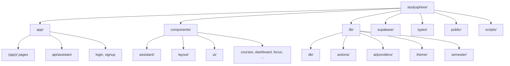

<p align="center">
  
</p>

<h1 align="center">StudySphere</h1>

<p align="center">
  <strong>Your Academic Command Center</strong><br />
  A production-grade student productivity platform with AI tutoring, scheduling, and focus tools.
</p>

<p align="center">
  <a href="https://studysph.me"></a>
  <a href="https://nextjs.org"></a>
  <a href="https://www.typescriptlang.org"></a>
  <a href="https://react.dev"></a>
  <a href="https://tailwindcss.com"></a>
  <a href="https://supabase.com"></a>
  <a href="https://vercel.com"></a>
</p>

<p align="center">
  <a href="https://studysph.me">Live Demo</a> ·
  <a href="#features">Features</a> ·
  <a href="#architecture">Architecture</a> ·
  <a href="#local-development">Local Setup</a> ·
  <a href="#deployment">Deploy</a> ·
  <a href="#contributing">Contributing</a>
</p>

---

<!-- Hero banner placeholder — replace with a designed 1280×640 asset -->
<p align="center">
  
</p>

## Project Description

**StudySphere** is a full-stack academic productivity SaaS built for college students. It combines course management, assignment tracking, a weekly calendar, Pomodoro focus sessions, and a streaming AI study tutor — all in one polished, mobile-first workspace.

The product is designed to feel like a real shipped application: Supabase auth with row-level security, server-only AI keys, interactive quizzes with gamification, Mermaid diagram rendering, semester import flows, and a custom domain deployment at [studysph.me](https://studysph.me).

## Live Demo

| | |
|---|---|
| **Production** | [https://studysph.me](https://studysph.me) |
| **Sign up** | [studysph.me/signup](https://studysph.me/signup) |
| **PWA** | Add to Home Screen from Safari for a native app feel |

Create a free account to explore the dashboard, AI tutor, quizzes, and semester setup flow.

## Features

| Category | Capabilities |
|----------|-------------|
| **Auth** | Email/password signup, login, logout, protected routes, profile bootstrap |
| **Dashboard** | Due-today stats, active courses, focus time, Plan My Day AI card |
| **Courses** | CRUD, color coding, archive, open-assignment counts |
| **Assignments** | Deadlines, status, priority, course linking, completion tracking |
| **Calendar** | Week view of assignments grouped by due date |
| **Focus Timer** | Pomodoro presets, session history, per-course tracking |
| **Semester Setup** | Manual course entry, CSV import, `.ics` calendar import, review-before-save |
| **AI Tutor** | Streaming chat, summarize, flashcards, interactive quizzes |
| **Themes** | Light / Dark / System + Vivid, Organic, Minimal, Aurora backgrounds |
| **Mobile** | Bottom nav, safe-area insets, responsive assistant panel, PWA metadata |

## Screenshots

> Add screenshots to `docs/screenshots/` and update paths below.

| Screen | Preview |
|--------|---------|
| Landing Page | `` |
| Dashboard | `` |
| Courses | `` |
| Assignments | `` |
| Calendar | `` |
| Focus Timer | `` |
| AI Chat | `` |
| Flashcards | `` |
| Quiz | `` |
| Settings | `` |
| Analytics | `` |
| Mobile View | `` |

## Demo GIFs

> Add recordings to `docs/gifs/` and embed below.

| Demo | Placeholder |
|------|-------------|
| Full walkthrough | `` |
| AI tutor demo | `` |
| Quiz demo | `` |
| Calendar demo | `` |

## AI Features

StudySphere ships a modular AI layer behind a single server route. API keys never reach the client.

| Mode | Behavior |
|------|----------|
| **Chat** | Streaming tutor with Markdown, KaTeX math, Mermaid diagrams, SVG sketches |
| **Summarize** | Structured summaries from pasted notes |
| **Flashcards** | Generated Q&A cards for any topic |
| **Quiz** | Interactive multiple-choice with setup (count, difficulty, practice/exam), streaks, score screen |
| **History** | Local session history — reopen chats, quizzes, summaries, flashcards |
| **Full-screen** | Expandable assistant workspace with keyboard shortcuts |

**Providers** (configured server-side): OpenRouter (recommended) → NVIDIA DeepSeek → OpenAI, with automatic fallback.

## Tech Stack

| Layer | Technology |
|-------|------------|
| Framework | [Next.js 16](https://nextjs.org) (App Router) |
| Language | [TypeScript 5](https://www.typescriptlang.org) |
| UI | [React 19](https://react.dev), [Tailwind CSS 4](https://tailwindcss.com) |
| Database | [Supabase](https://supabase.com) (PostgreSQL + RLS) |
| Auth | Supabase Auth (SSR cookie sessions) |
| AI | [OpenRouter](https://openrouter.ai), NVIDIA DeepSeek, OpenAI |
| Diagrams | [Mermaid](https://mermaid.js.org), KaTeX |
| Icons | Lucide React |
| Deploy | [Vercel](https://vercel.com) |

## Architecture

### Application Architecture



### Authentication Flow



### Database Relationships



### AI Request Pipeline



### Deployment Architecture



### Study Workflow



### System Design Overview

| Concern | Implementation |
|---------|----------------|
| **Frontend** | React Server Components + client islands, Tailwind design tokens |
| **Backend** | Next.js Server Actions for mutations, one API route for AI streaming |
| **Database** | Supabase PostgreSQL with RLS on every table |
| **Authentication** | Supabase Auth, cookie-based SSR via `@supabase/ssr` |
| **AI** | Provider router with fallback chain; SSE streaming; server-only keys |
| **State** | Server data via RSC; theme + AI history in `localStorage` |
| **Storage** | Supabase for user data; browser `localStorage` for AI session history |
| **Deployment** | Vercel serverless, custom domain, env-based configuration |

## Folder Structure



### `app/`

Next.js App Router entry points.

| Path | Purpose |
|------|---------|
| `page.tsx` | Marketing landing page |
| `login/`, `signup/` | Authentication pages |
| `(app)/` | Protected application shell |
| `(app)/dashboard/` | Personalized overview |
| `(app)/courses/` | Course management |
| `(app)/assignments/` | Assignment tracking |
| `(app)/calendar/` | Weekly schedule |
| `(app)/focus/` | Pomodoro timer |
| `(app)/analytics/` | Productivity insights |
| `(app)/profile/` | User profile |
| `(app)/settings/` | Preferences and appearance |
| `(app)/semester-setup/` | Semester import wizard |
| `api/assistant/` | AI streaming endpoint |
| `layout.tsx` | Root layout, fonts, theme script |
| `manifest.ts` | PWA manifest |

### `components/`

Feature-organized React components.

| Directory | Responsibility |
|-----------|---------------|
| `assistant/` | AI panel, chat, quiz, Mermaid, history |
| `layout/` | Shell, sidebar, top nav, mobile nav |
| `ui/` | Design system primitives |
| `auth/` | Login and signup forms |
| `courses/` | Course cards and dialogs |
| `assignments/` | Assignment list and forms |
| `dashboard/` | Stats, due-soon, plan-my-day |
| `focus/` | Timer UI and session history |
| `calendar/` | Week calendar grid |
| `settings/` | Appearance and preferences |
| `semester-setup/` | Import wizard |
| `providers/` | Theme and toast context |
| `landing/` | Marketing sections |

### `lib/`

Server and shared business logic.

| Directory | Responsibility |
|-----------|---------------|
| `supabase/` | Browser, server, and middleware clients |
| `db/` | Typed Supabase queries |
| `actions/` | Server Actions (auth, CRUD, import) |
| `ai/` | Prompts, provider router, quiz parsing |
| `ai/providers/` | OpenRouter, NVIDIA, OpenAI adapters |
| `semester/` | CSV/ICS parsers and import types |
| `theme/` | Design-token theme system |
| `focus/` | Pomodoro presets and break logic |

### `supabase/`

| File | Purpose |
|------|---------|
| `schema.sql` | Full database schema with RLS policies |
| `migrations/` | Incremental schema changes |

### `types/`

Shared TypeScript definitions for database rows, navigation, and action results.

### `public/`

Static assets: favicons, PWA icons, landing images, brand files.

### `scripts/`

| Script | Purpose |
|--------|---------|
| `generate-icons.mjs` | Regenerate favicon and PWA icon set |
| `fetch-landing-images.mjs` | Fetch landing page photography |

## Database Schema Overview

Six core tables, all protected by Supabase Row Level Security:

| Table | Purpose |
|-------|---------|
| `profiles` | Academic identity (name, major, university) |
| `user_preferences` | Timer durations, notifications, theme settings |
| `courses` | Semester courses with color coding |
| `assignments` | Deadlines, status, priority, course link |
| `study_sessions` | Focus timer history |

Enums: `assignment_status`, `assignment_priority`, `course_color_key`, `session_type`.

Apply schema: run [`supabase/schema.sql`](supabase/schema.sql) in the Supabase SQL Editor.

## Calendar Integration

Assignments with `due_at` timestamps render in the weekly calendar view. The semester setup flow supports `.ics` import — events are parsed client-side, previewed, and mapped to courses and assignments before confirmation.

## Quiz Engine

1. User selects question count, difficulty, and practice/exam mode.
2. System prompt instructs the model to return structured JSON only.
3. While streaming, a loading state hides raw JSON from the user.
4. `lib/ai/quiz-parse.ts` validates the payload.
5. `AssistantInteractiveQuiz` renders clickable options with streak tracking, celebrations, and a final score screen.

## Flashcards

AI generates Q&A pairs in flashcard mode. The assistant renders formatted cards from the model's Markdown output.

## Mermaid Diagrams

The AI tutor is instructed to output ` ```mermaid ` code blocks for flowcharts and process diagrams. `AssistantMermaid` renders them client-side via the Mermaid library. Simple labeled sketches use inline SVG code blocks.

## Performance

| Technique | Usage |
|-----------|-------|
| **SSR / RSC** | Dashboard and list pages fetch data on the server |
| **Server Actions** | Mutations without client-side API boilerplate |
| **Streaming** | AI responses via Server-Sent Events |
| **Caching** | Next.js static generation for landing; dynamic for authenticated routes |
| **Lazy loading** | Mermaid initialized on demand in diagram components |
| **Optimizations** | Turbopack dev/build, CSS design tokens, minimal client bundles per route |

## Security

| Measure | Detail |
|---------|--------|
| **Server-only API keys** | `OPENROUTER_API_KEY` and alternatives never exposed to the browser |
| **Supabase RLS** | Every table scoped to `auth.uid()` |
| **Protected routes** | `(app)/layout.tsx` redirects unauthenticated users |
| **Middleware** | Session refresh on every request |
| **Input validation** | Server Actions validate all form input before DB writes |
| **Environment variables** | Secrets in `.env.local` (gitignored); template in `.env.local.example` |
| **Quiz safety** | Raw AI JSON never rendered; validated before display |

## Environment Variables

```bash
cp .env.local.example .env.local
```

| Variable | Required | Description |
|----------|----------|-------------|
| `NEXT_PUBLIC_SUPABASE_URL` | Yes | Supabase project URL |
| `NEXT_PUBLIC_SUPABASE_ANON_KEY` | Yes | Supabase anon key (`eyJ...` legacy key recommended) |
| `OPENROUTER_API_KEY` | For AI | OpenRouter API key |
| `AI_PROVIDER` | For AI | `openrouter`, `nvidia`, `openai`, or `auto` |
| `OPENROUTER_MODEL` | No | Model slug (default: `deepseek/deepseek-chat`) |
| `NVIDIA_API_KEY` | No | Alternative AI provider |
| `OPENAI_API_KEY` | No | Alternative AI provider |

## Local Development

### Prerequisites

- Node.js 20+
- npm
- Supabase project

### Setup

```bash
git clone https://github.com/Michael5577/studysphere.git
cd studysphere
npm install
cp .env.local.example .env.local
# Fill in Supabase + OpenRouter credentials
```

### Database

1. Open Supabase → **SQL Editor**
2. Run [`supabase/schema.sql`](supabase/schema.sql)
3. Verify tables: `profiles`, `user_preferences`, `courses`, `assignments`, `study_sessions`

### Run

```bash
npm run dev
```

Open [http://localhost:3000](http://localhost:3000).

### Scripts

| Command | Description |
|---------|-------------|
| `npm run dev` | Development server |
| `npm run build` | Production build |
| `npm run start` | Production server |
| `npm run lint` | ESLint |
| `npm test` | Lint + production build |
| `npm run icons` | Regenerate PWA icons |

## Production Deployment

### Vercel

1. Push to GitHub
2. Import project in [Vercel](https://vercel.com)
3. Add environment variables (Production + Preview)
4. Deploy from `main`
5. Add custom domain under **Settings → Domains**

### Supabase

1. Create a production Supabase project
2. Run `supabase/schema.sql`
3. Run any migrations in `supabase/migrations/`
4. Copy URL and anon key to Vercel env vars

### Custom Domain

Point DNS to Vercel:

- Apex: Vercel A record
- `www`: CNAME to `cname.vercel-dns.com`

Current production domain: [studysph.me](https://studysph.me)

**Important:** Redeploy after changing any environment variable.

## API Routes

| Route | Methods | Auth | Description |
|-------|---------|------|-------------|
| `/api/assistant` | `GET` | Required | Returns AI live status and provider configuration |
| `/api/assistant` | `POST` | Required | Chat completion with optional SSE streaming |

All other data mutations use **Server Actions** in `lib/actions/` — no additional REST endpoints.

### POST `/api/assistant` body

```json
{
  "mode": "chat",
  "message": "Explain photosynthesis",
  "history": [],
  "stream": true
}
```

Modes: `chat`, `summarize`, `flashcards`, `quiz`.

## Future Roadmap

- [ ] Supabase-backed AI history sync across devices
- [ ] Syllabus PDF AI extraction
- [ ] Spaced-repetition flashcard review
- [ ] Push notifications for assignment reminders
- [ ] Shared study groups
- [ ] Grade tracking and GPA projections
- [ ] Native iOS / Android apps

## Contributing

Contributions are welcome. Please follow these guidelines:

1. Fork the repository
2. Create a feature branch (`git checkout -b feat/your-feature`)
3. Run `npm run lint` and `npm run build` before committing
4. Write clear commit messages
5. Open a pull request with a description of changes

For large features, open an issue first to discuss scope.

## License

[MIT](LICENSE) © 2026 Michael Serbeh

---

<p align="center">
  Built with focus. Shipped with care.<br />
  <a href="https://studysph.me">studysph.me</a>
</p>
